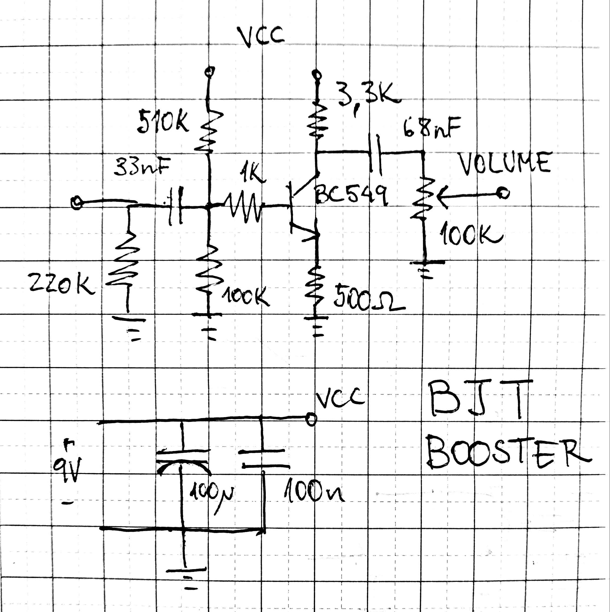

My goal here was to design a very simple booster using only one transistor. No tone shaping is intended, though different cap values could be chosen for some treble boosting like the Dallas Rangemaster. I chose not to bypass the emitter resistor to improve linearity. This circuit is **not** intended as an overdrive, as I think it would sound kinda bad as is.

 
 
 

{width=50%}

