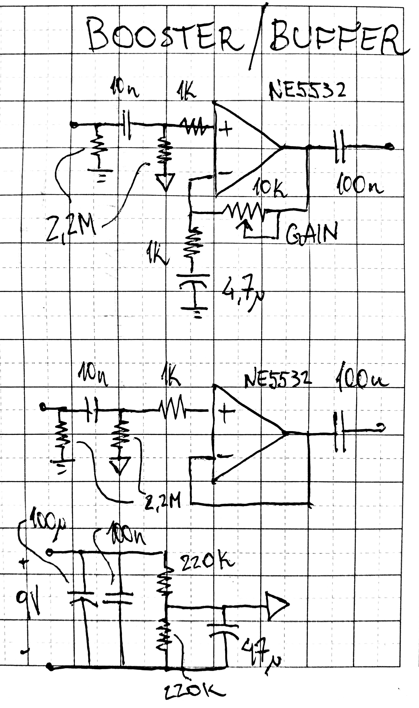

[Home](../)

This one was one of my first designs, and arised out of a necessity to have a preamp and a booster to facilitate my experimentations. With this nifty little guy I can put my low output high impedance guitar signal anywhere I want, and output any node in the circuit (very helpful for debugging) to my test amplifier. Very text-book circuit using the NE5532, but it does its job remarkably well. If done again, I would include some limiting and pull down resistors at the outputs.  

 

{width=40%}

