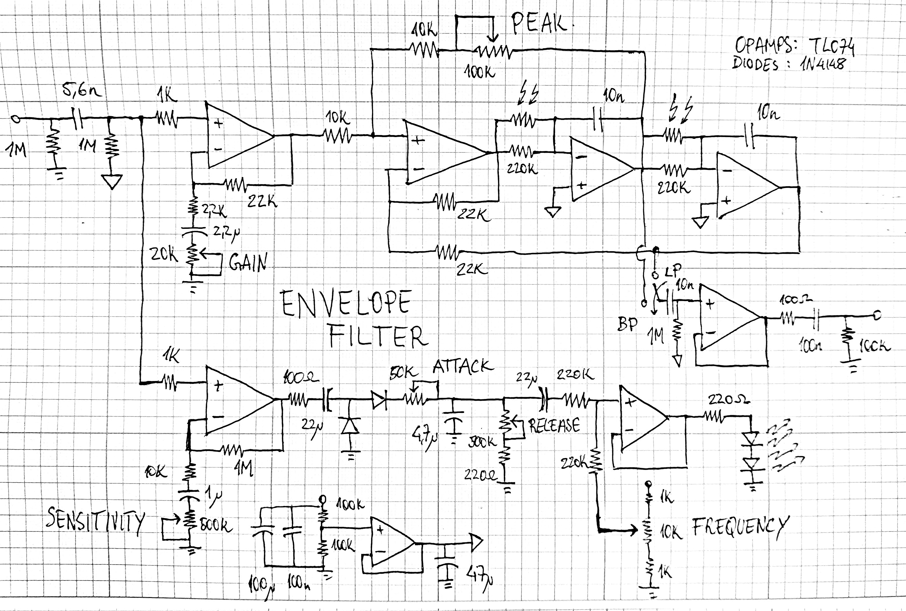

My take on the classic Mutron envelope filter using a single supply (the Mutron uses dual +9/-9V). The envelope follower is quite different, but it's easier to implement with the single supply. The Vactrols I used where the homemade shrinking tube LED/LDR kind. Didn't include the "wah/wow" switch in the diagram, but it's easily doable. I also omitted the High Pass output, but that was just a matter of only having SPDT switches instead of SP3T one. I also included a Frequency potentiometer and separate Gain and Sensitivity controls for more versatility. 

 

