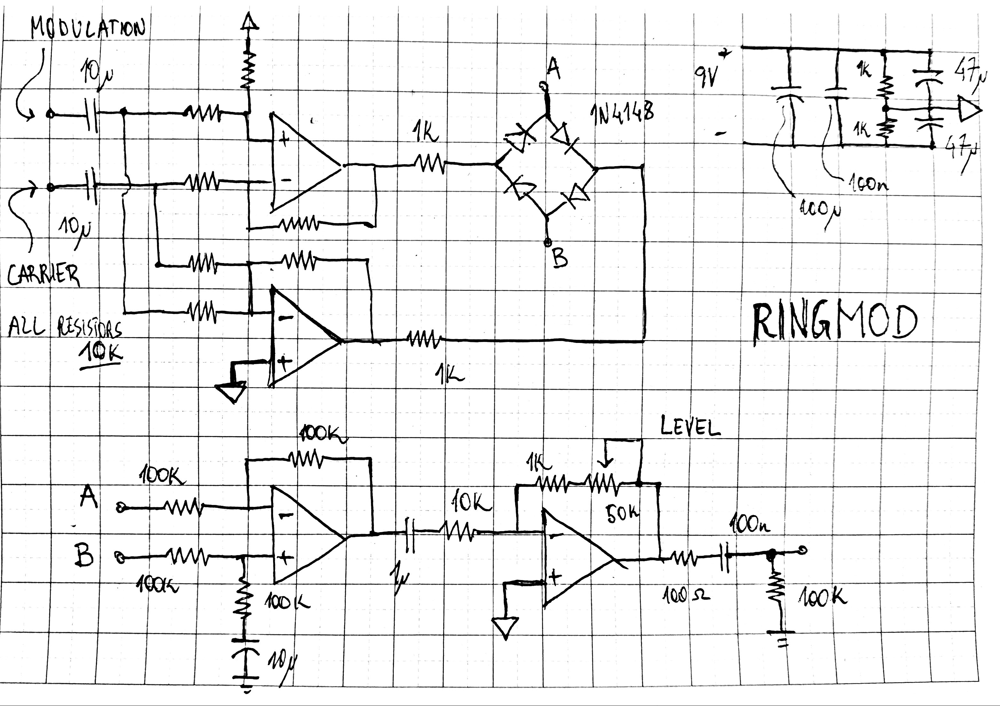

[Home](../)

A transformerless diode ring modulator. The summing and subtracting of the carrier and modulation signal are done using opamps, with a differential amplifier reading the diode ring output.
I found that the it sounds slightly better using a sinusoidal carrier, for which the [Wien Brigde Oscillator](./wien.html) circuit could be used. Alternatively, a relaxation oscillator could be used for simplicity.

 

