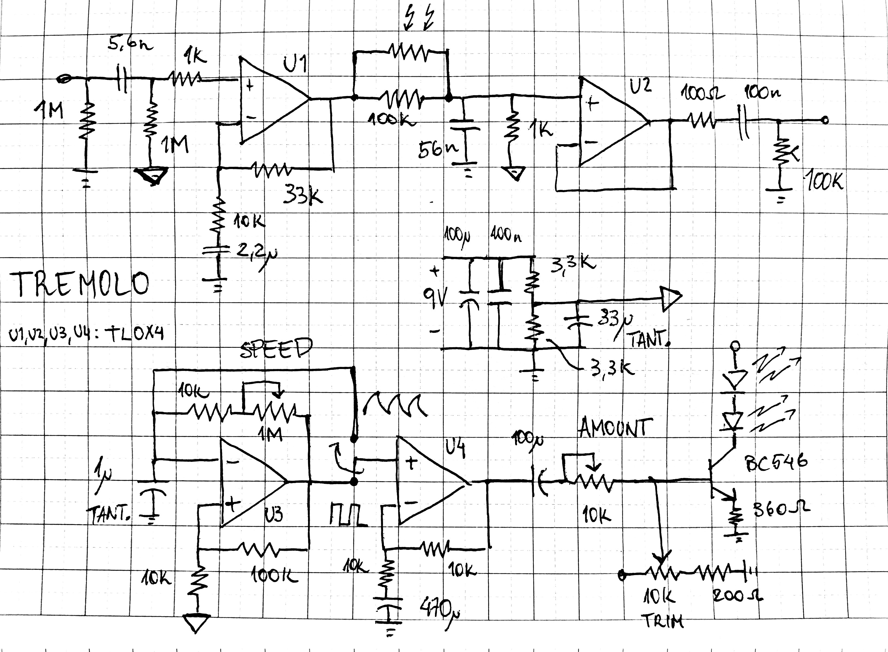

[Home](../)

Simple tremolo circuit using LDR's. Besides amplitude modulation, there's an one pole low pass filter modulation.
LFO is a relaxation oscillator, with "triangle" (more like a sharktooth) and square outputs.

{width=80%}

