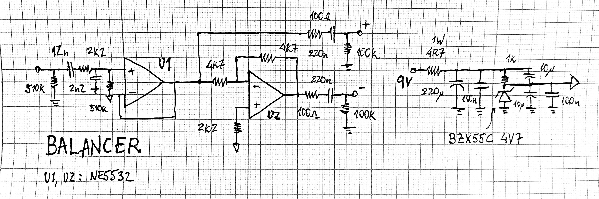

[Home](../)

## V1

A friend of mine asked me to make it possible to connect his guitar, bass and unbalanced whatnot to his new preamp/compressor that only has balanced inputs. So, here it is. Very simple stuff, no phase compensation. Ground can be connected or not to the XLR plug (leave unconnected for "ground lift").

 

 

## V2
So, it arised from my experimentations the need for my own unbalanced to balanced circuit, so here is its second incarnation. After checking, turns out the zener is actually 4v3 and not 4v7, but it shouldn't make a difference. 

 

