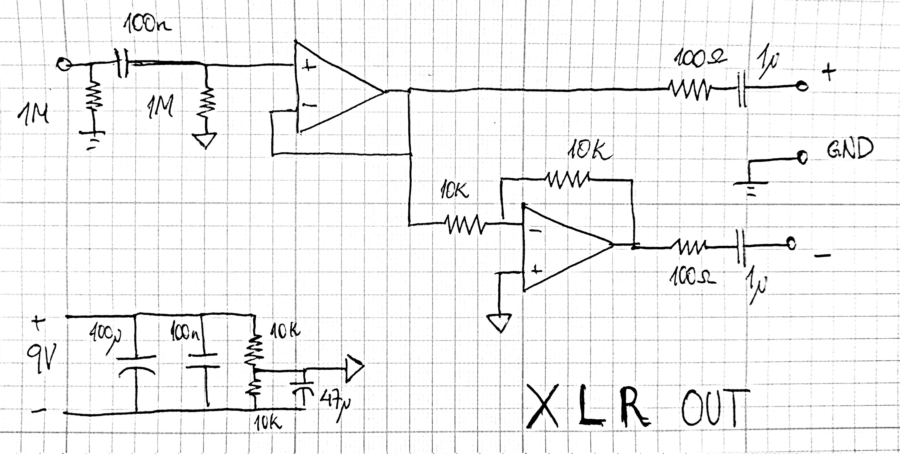

[Home](../)

A friend of mine asked me to make it possible to connect his guitar, bass and unbalanced whatnot to his _vintage_ and _cool_ preamp/compressor that only has balanced inputs. So, here it is. Very simple stuff, no phase conpensation. Ground can be connected or not to the XLR plug (leave unconnected for "ground lift").

 

