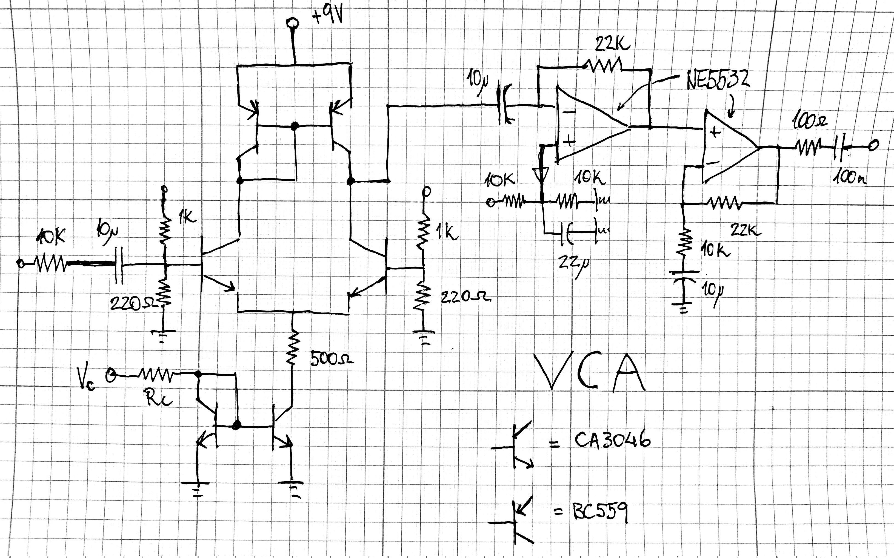

[Home](../)

A single 9V supply voltage controlled amplifier based on a discrete OTA topology. Input amplitude must be adequately small as not to saturate the OTA. The voltage control is linear, and the resistor Rc should be calculated depending on the maximum expected CV. The CA3046 can be substituted by regular BC549's if unavailable. If using the 3046, remember to connect the substrate pin to ground. It seems to work fine as per the SPICE simulations, but I haven't got around to building it yet.

 

