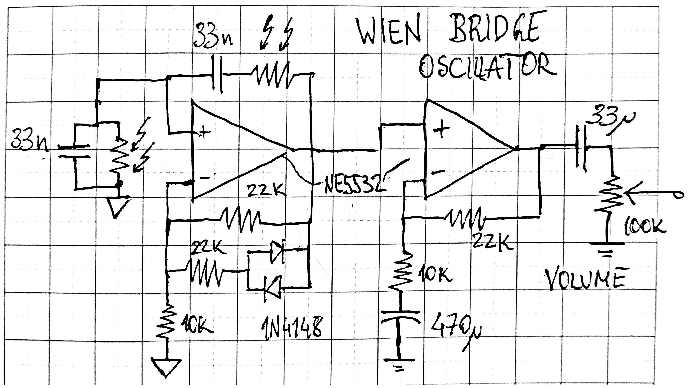
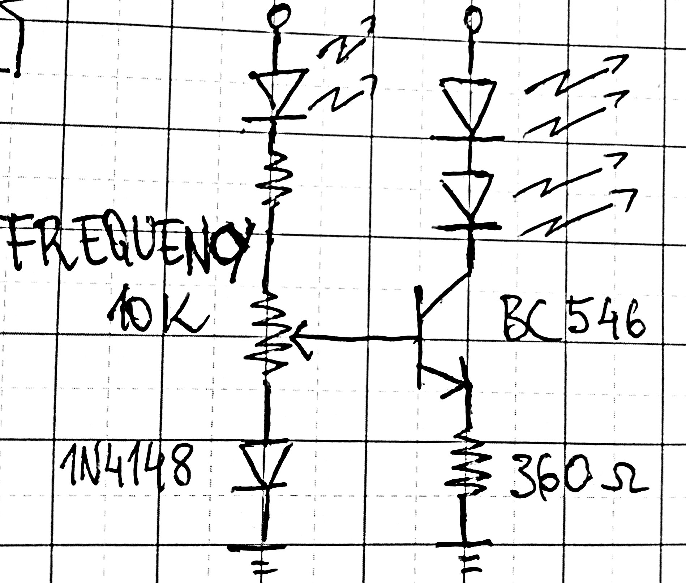
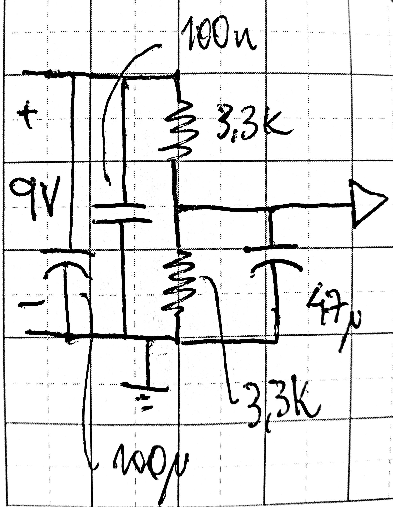

A variable Wien Bridge Oscillator, including an output stage. I needed this one to have a decent sinusoidal generator for testing. Distortion is not great, as it uses simple diode stabilisation. I ended up using dual LDR's, as getting dual-ganged potentiometers is not very easy here (plus, much more expensive - even if you take the led driver circuit components into account).
 

The oscillator:

{width=70%}

The driver circuit:

{width=30%}

And just for the sake of completion, the power supply:

{width=20%}

